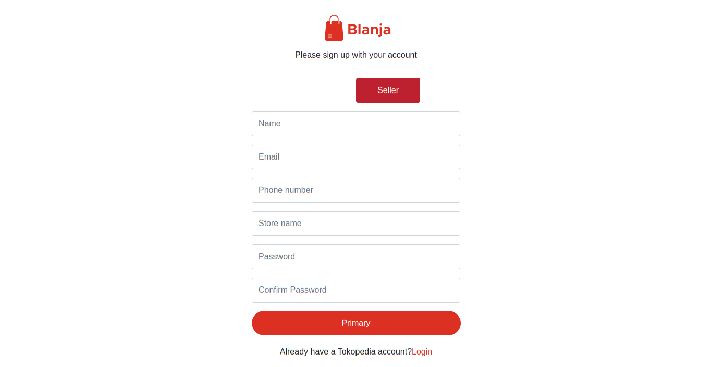
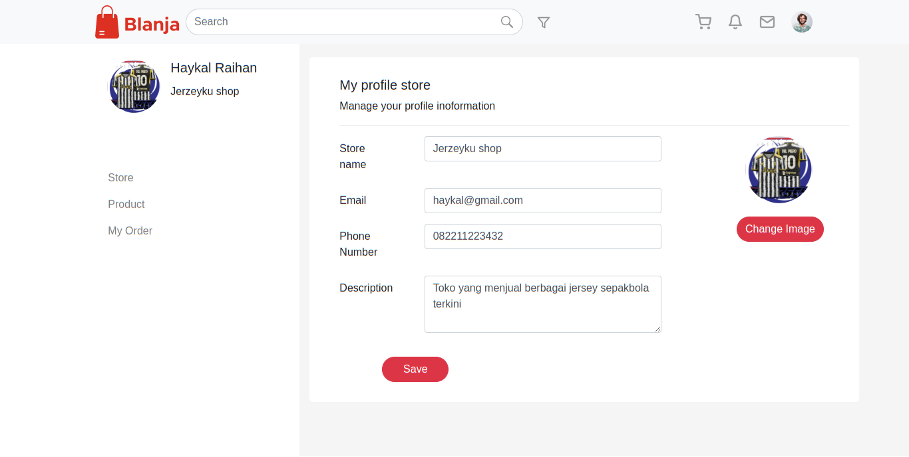

<br />
<p align="center">
  <div align="center">
    
  </div>
  <h3 align="center">Blanja</h3>
  <p align="center">
    <a href="https://github.com/vineas/backend-expressjs-blanja_project"><strong>Explore the docs »</strong></a>
    <br />
    <a href="https://blanja-react-beginner.vercel.app">View Demo</a>
    ·
    <a href="https://backend-expressjs-blanja-project.vercel.app/">Api Demo</a>
  </p>
</p>


## Table of Contents

- [Table of Contents](#table-of-contents)
- [About The Project](#about-the-project)
  - [Built With](#built-with)
- [Installation](#installation)
  - [Documentation](#documentation)
  - [Related Project](#related-project)
- [Contributors](#contributors)
  - [Meet The Team Members](#meet-the-team-members)

  # About The Project

Blanja is an E-commerce website project that aims to provide an easy and convenient online shopping experience for users in Indonesia. The site offers a wide range of products, including fashion, beauty, electronics, and food and beverages.

To use Blanja's services, users only need to create an account and enter their payment details. After that, users can browse products, add them to their shopping cart, and choose their preferred payment method.

With all the features and security provided, Blanja is expected to provide a safe, easy, and convenient online shopping experience for users across Indonesia.


## Built With

These are the libraries and service used for building this backend API

- [ReactJS](https://react.dev/)
- [Bootstrap](https://getbootstrap.com/)
- [React-icons](https://react-icons.github.io/react-icons/)
- [Axios](https://axios-http.com)
- [Sweetalert2](https://sweetalert2.github.io)

# Getting Started

## Prerequisites

You'll need these programs installed before proceeding to installation

- [Git](https://git-scm.com/downloads)
- [Node.js](https://nodejs.org/en/download)

This project requires [hirejob-backend](https://github.com/vineas/backend-expressjs-blanja_project/) to function properly, follow the steps provided in the readme to install and run the backend API


## Installation

Follow this steps to run the server locally

1. Clone this repository

```sh
git clone https://github.com/vineas/blanja-react_beginner
```

2. Change directory to blanja-react_beginner

```sh
cd blanja-react_beginner
```

3. Install all of the required modules

```sh
npm install
```

4. Create and configure `.env.local` file in the root directory, example env are provided in [.env.local.example](./.env.local.example)

```env
NEXT_PUBLIC_API_URL=[ Backend URL ]
```

5. Run this command to run the server in development environment

```sh
npm run start
```

- Run this command to build this website into production ready

```sh
npm run build
```


# Screenshots

<table>
 <tr>
    <td></td>
    <td> </td>
  </tr>
  <tr>
    <td>Login Customer</td>
    <td>Register Customer</td>
  </tr>
 <tr>
    <td></td>
    <td> </td>
  </tr>
  <tr>
    <td>Login Seller</td>
    <td>Register Seller</td>
  </tr>
  <tr>
    <td> </td>
    <td></td>
  </tr>
   <tr>
    <td>Home</td>
    <td>Detail Product</td>
  </tr>
    <tr>
    <td></td>
    <td> </td>
  </tr>
   <tr>
    <td>Mybag</td>
    <td>Checkout</td>
  </tr>
    <tr>
    <td></td>
    <td> </td>
  </tr>
   <tr>
    <td>Profile Customer</td>
    <td>Customer Address</td>
  </tr>
    <tr>
    <td></td>
    <td> </td>
  </tr>
   <tr>
    <td>Customer Order</td>
    <td>Profile Seller</td>
  </tr>
    <tr>
    <td></td>
    <td> </td>
  </tr>
   <tr>
    <td>Seller Product</td>
    <td>Seller Order</td>
  </tr>

</table>

## Related Project

:rocket: [`Backend Blanja`](https://github.com/vineas/backend-expressjs-blanja_project)

:rocket: [`Frontend Blanja`](https://github.com/vineas/blanja-react_beginner)

:rocket: [`Demo Blanja`](https://blanja-react-beginner.vercel.app)
